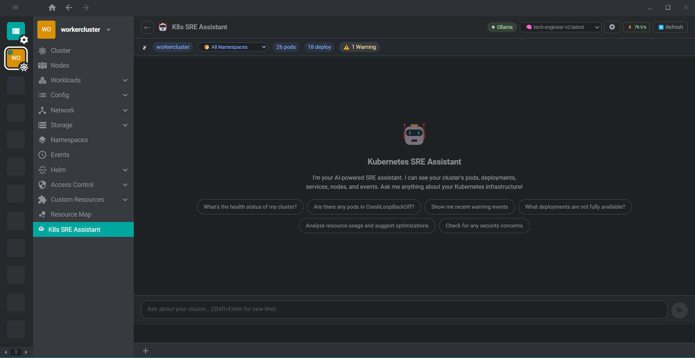
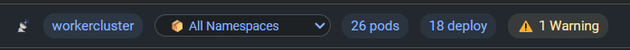
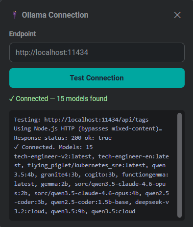
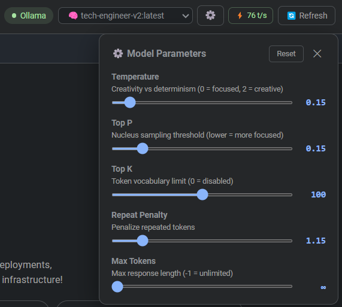
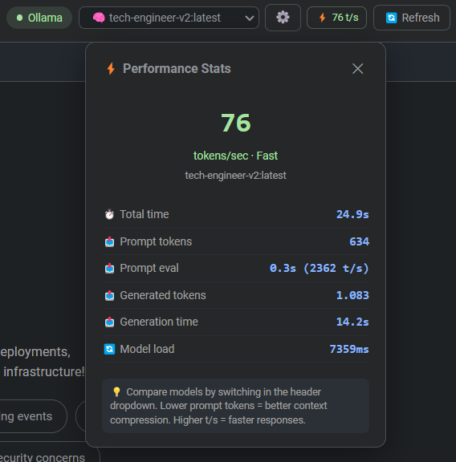
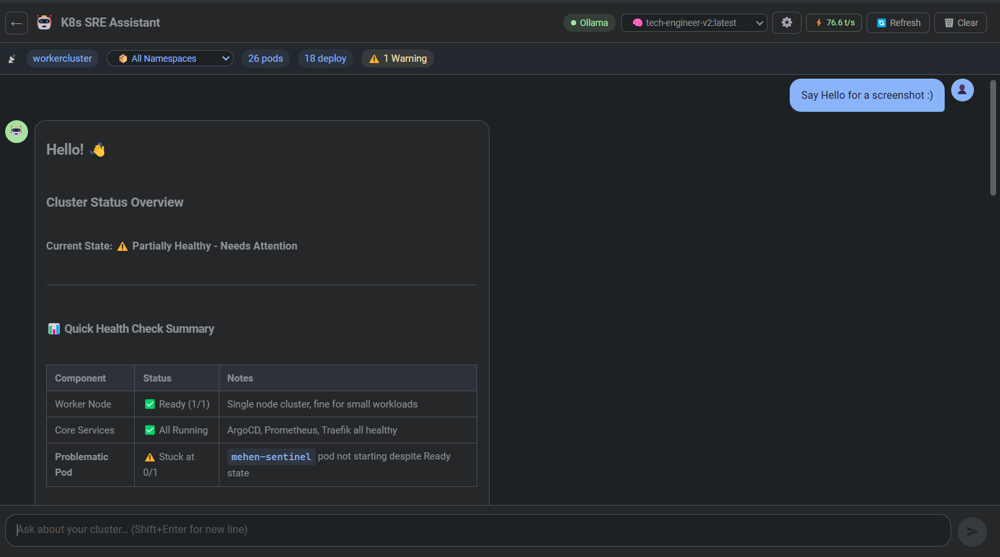

# 🤖 K8s SRE Assistant - Freelens Extension

A Freelens extension that adds an AI-powered **Kubernetes SRE (Site Reliability Engineer)** assistant tab to your cluster view. Chat with an Ollama-powered AI model that can see your cluster's resources and help you troubleshoot, optimize, and manage your Kubernetes infrastructure.


## 📸 Screenshots

<!-- TODO: Add screenshots -->
| Screenshot | Description |
|:----------:|-------------|
 | **Chat interface** — Ask questions about your cluster, get streaming Markdown responses |
 | **Context bar** — Cluster name, namespace selector, resource counts, health badge |
 | **Connection panel** — Configure Ollama endpoint, test connectivity |
 | **Model parameters** — Tune temperature, top_p, top_k, repeat penalty |
 | **Performance stats** — Tokens/sec, prompt eval, generation time |
 | **Friendly cluster overview**

## ✨ Features

### Core
- **🧠 AI Chat Interface** — Conversational AI assistant integrated directly into Freelens
- **👁️ Cluster Awareness** — The AI sees your pods, deployments, services, nodes, and events in real-time via direct K8s API calls (`KubeApi.list()`)
- **📡 Ollama Integration** — Uses local or remote Ollama for privacy-first AI (no data leaves your network)
- **💬 Streaming Responses** — Real-time streaming with a block-level Markdown renderer safe for incomplete output
- **🛑 Cancelable** — Stop AI generation at any time

### Smart Context Management (for small models)
- **📦 Namespace Selector** — Filter context to a specific namespace in the UI; cluster-scoped resources (nodes) remain visible regardless
- **🧩 Context Pipeline** — In-process ChunkManager → BM25 Retriever → SummaryManager → ContextBuilder pipeline prevents "lost-in-the-middle" with small (2-4B) models
- **📊 BM25 Retrieval** — K8s-aware keyword retrieval (pure TypeScript) preserves compound terms like `kube-system`, `apps/v1`, pod names, and IPs as searchable tokens. Retrieval runs only on non-summarised messages to avoid duplicating the summary
- **📝 Non-Blocking Summarisation** — When conversation exceeds 20 exchange pairs, old turns are compressed into a two-section summary (stable **Facts & Decisions** + query-focused **Rolling Context**) via a background Ollama call *after* the response is delivered — zero added latency
- **🔢 Token Budget** — Cluster context and conversation history are capped and cleaned (noisy labels stripped, event messages truncated, per-resource limits) to stay within small model context windows
- **🚨 Anomaly-First Sorting** — Pods in CrashLoopBackOff/Error/OOMKilled, deployments with replica mismatch, and NotReady nodes are sorted to the top *before* truncation, so the AI always sees the most actionable resources
- **🧹 Clean Data** — `managedFields`, long annotations, `pod-template-hash`, and other noisy K8s metadata are stripped before passing to the model

### UI & Developer Experience
- **🧠 In-Chat Model Selector** — Switch Ollama models directly from the chat header
- **⚡ Performance Stats** — After each response, see tokens/sec, prompt tokens, generation time, and model load time in a stats panel — compare models instantly
- **📡 Context Bar** — Shows cluster name, selected namespace, pod/deployment counts, and warning count
- **⚙️ In-Chat Model Parameters** — Tune temperature, top_p, top_k, repeat penalty, and max tokens
- **🔌 In-Chat Connection Panel** — Configure endpoint, test connection via Node.js HTTP (no mixed-content issues)
- **💾 Persistent Settings** — All settings saved to `localStorage` and synced across Freelens contexts
- **⬅️ Back Navigation** — One-click return to the cluster dashboard

### Network & Compatibility
- **🔒 No Mixed-Content Issues** — All Ollama API calls use Node.js `http`/`https` modules instead of browser fetch/XHR, so connecting to plain HTTP Ollama instances from the Electron renderer works reliably
- **🌐 Remote Ollama** — Full support for remote Ollama instances (set `OLLAMA_ORIGINS=*` and `OLLAMA_HOST=0.0.0.0:11434` on the host)
- **☁️ Cloud Ollama** — Automatic sanitisation of model parameters (e.g. `num_predict: -1` is stripped) so cloud-hosted Ollama instances don't reject requests

## 📋 Requirements

- **Freelens** >= 1.4.0
- **Ollama** running locally or on the network
- At least one Ollama model pulled (e.g., `llama3.2`, `qwen3`, `mistral`)

## 🚀 Quick Start

### 1. Install Ollama

```bash
# macOS / Linux
curl -fsSL https://ollama.com/install.sh | sh

# Start Ollama
ollama serve
```

### 2. Pull a Model

```bash
# Recommended for SRE tasks
ollama pull llama3.2        # General purpose, good balance (3B)
ollama pull qwen3            # Fast, great for structured data (4B)
ollama pull mistral          # Capable all-rounder (7B)
ollama pull deepseek-coder   # Excellent for YAML/config (6.7B)
```

### 3. Install the Extension

```bash
git clone https://github.com/biurea/freelens-k8s-sre-assistant.git
cd freelens-k8s-sre-assistant
pnpm install
pnpm build
pnpm pack
```

Then in Freelens: **Extensions** → **Add Local Extension** → select the `.tgz` file.

## 🎯 What Can It Do?

### Cluster Health
- "What's the health status of my cluster?"
- "Are there any pods in CrashLoopBackOff?"
- "Show me recent warning events"
- "List all namespaces"

### Troubleshooting
- "Why is my deployment not rolling out?"
- "Help me debug this pod that keeps crashing"
- "What's causing high memory usage on node X?"

### Optimization
- "Analyze resource usage and suggest optimizations"
- "Are there any pods without resource limits?"
- "Suggest HPA configurations for my deployments"

### Security
- "Check for any security concerns in my cluster"
- "Are there pods running as root?"
- "Review my RBAC configuration"

### Operations
- "How do I scale this deployment?"
- "Generate a network policy for namespace isolation"
- "Help me write a pod disruption budget"

## ⚙️ Configuration

### Chat Header Controls

All primary configuration lives directly in the chat UI.

#### 🔌 Connection Panel (Ollama badge)

Click the **Ollama** / **Disconnected** badge to open the connection overlay:

- **Endpoint input** — set the Ollama URL (e.g. `http://localhost:11434`)
- **Test Connection** — one-click test using Node.js HTTP (bypasses mixed-content)
- **Debug log** — detailed diagnostics with troubleshooting hints

#### 📦 Namespace Selector (context bar)

The dropdown in the context bar lets you scope the AI's view to a single namespace:

- **All Namespaces** — model sees pods/deployments/services/events from all namespaces (with limits)
- **Specific namespace** — only namespaced resources from that namespace are included; nodes and the namespace list remain global

Changing namespace triggers an automatic context refresh.

#### ⚡ Performance Stats (⚡ t/s button)

After each response, a green button shows generation speed. Click to see:

| Metric | Description |
|--------|-------------|
| Tokens/sec | Generation speed (🟢 ≥20, 🟡 ≥8, 🔴 <8) |
| Total time | End-to-end response time |
| Prompt tokens | Tokens in the full context sent to the model |
| Prompt eval | Time to process the prompt |
| Generated tokens | Tokens in the AI's response |
| Generation time | Time spent generating |
| Model load | Time to load the model into memory |

Use this to compare models and find the best speed/quality tradeoff.

#### 🧠 Model Selector

The header dropdown lists all available Ollama models. Switching takes effect immediately.

#### ⚙️ Model Parameters (⚙️ button)

| Parameter | Range | Description |
|-----------|-------|-------------|
| Temperature | 0 – 2 | Creativity vs determinism |
| Top P | 0 – 1 | Nucleus sampling threshold |
| Top K | 0 – 200 | Token vocabulary limit |
| Repeat Penalty | 1 – 2 | Penalize repeated tokens |
| Max Tokens | -1 – 8192 | Response length (-1 = unlimited) |

### Preferences Panel

Open **Freelens → Preferences → K8s SRE Assistant** for basic setup:

| Setting | Default | Description |
|---------|---------|-------------|
| Ollama Endpoint | `http://localhost:11434` | URL of your Ollama instance |
| Auto-refresh context | `true` | Gather cluster state before each message |

## 🏗️ Architecture

```
src/
├── main/
│   └── index.ts                          # Main process entry (Freelens lifecycle)
├── renderer/
│   ├── index.tsx                         # Renderer entry (registers pages, menus, preferences)
│   ├── components/
│   │   ├── sre-chat.tsx                  # Chat UI + ConnectionPanel + ModelParamsPanel + StatsPanel
│   │   └── markdown-renderer.tsx         # Streaming-safe block-level Markdown → HTML renderer
│   ├── icons/
│   │   └── sre-icon.tsx                  # Sidebar icon
│   ├── pages/
│   │   └── sre-assistant-page.tsx        # Freelens cluster page wrapper
│   ├── preferences/
│   │   └── sre-preferences.tsx           # Freelens Preferences panel
│   ├── services/
│   │   ├── ollama-service.ts             # Ollama API (Node.js HTTP, streaming, stats capture)
│   │   ├── k8s-context-service.ts        # K8s context via KubeApi.list() + namespace filtering
│   │   └── context/                      # 🧩 Context management pipeline
│   │       ├── index.ts                  #    Barrel export
│   │       ├── chunk-manager.ts          #    Sliding-window chunker (~300 words, 50 overlap)
│   │       ├── bm25-retriever.ts         #    Pure-TS BM25 (k1=1.5, b=0.75) keyword retrieval
│   │       ├── summary-manager.ts        #    On-demand Ollama-based conversation compression
│   │       └── context-builder.ts        #    Assembles: system → summary → BM25 chunks → recent → query
│   └── stores/
│       └── chat-store.ts                 # MobX state + context pipeline orchestration
└── common/
    └── types.ts                          # Shared TypeScript types
```

### Context Pipeline Flow

On every user message:

```
1. Build system prompt (SRE persona + live K8s cluster data, anomalies sorted first)
2. Use existing summary from previous cycle (non-blocking)
3. ChunkManager.buildChunks()           → split NON-SUMMARISED history into ~300-word overlapping chunks
4. BM25Retriever.retrieve(query, 5)     → top-5 keyword-relevant chunks (K8s-aware tokenizer)
5. ContextBuilder.assemble()             → ordered: system + summary + chunks + recent turns + query
   └─ Jaccard deduplication removes chunks redundant with recent messages
6. OllamaService.streamChatAssembled()   → stream response, capture performance stats
7. (post-response) SummaryManager.maybeCompress()  → background: compress old turns if >20 pairs
   └─ Two-section output: FACTS & DECISIONS (persistent) + ROLLING CONTEXT (query-focused)
```

This prevents the "lost-in-the-middle" problem where small models forget information buried in long contexts.

**Key properties:**
- Zero npm dependencies for the pipeline — pure TypeScript
- Summarisation runs *after* the response (no added latency)
- BM25 retrieves only from non-summarised messages (no duplicate context)
- K8s-aware tokenizer preserves compound terms (`kube-system`, `apps/v1`, IPs)
- Anomalous resources (CrashLoopBackOff, replica mismatch, NotReady) survive truncation
- Two-section summary preserves stable facts across rewrites
- Token budget capped at ~2800 words to fit 4k-context models

## 🗺️ Roadmap

Inspired by ideas visible in the local [freelens-ai-extension](freelens-ai-extension/README.md) repo, but adapted to this extension's SRE-first identity.

### Near-term improvements

- **Preset SRE modes** — Add opinionated chat modes such as **Troubleshoot**, **Security Review**, **Cost Check**, **Capacity Planning**, and **YAML Helper** instead of a generic AI mode switch
- **Suggested actions, not just answers** — Turn responses into clickable follow-ups like “inspect events”, “compare replicas”, “focus this namespace”, or “draft a NetworkPolicy”
- **Object-aware entry points** — Open the assistant from a pod, deployment, node, or event and prefill the chat with that resource as the active investigation target
- **Tool visibility panel** — Show which cluster capabilities/context sources are available for the current message, similar to the “available tools” concept, but framed as **SRE data sources**
- **Session persistence** — Persist conversations per cluster and namespace, so investigations survive app restarts and can be resumed later
- **Export incident summary** — Export a conversation into a compact markdown incident note with facts, findings, commands, and next steps

### SRE-native agent workflow

- **Specialized internal agents** — Introduce lightweight internal roles such as **Investigator**, **Explainer**, **YAML Author**, and **Change Planner**, while keeping the UI simple and single-threaded
- **Read-first, write-later workflow** — Separate analysis from mutation: first explain what is wrong, then generate the exact patch or manifest, and only later support controlled apply actions
- **Runbook generation** — Convert successful troubleshooting sessions into reusable runbooks/checklists for future incidents
- **Event and log correlation** — Expand from raw cluster objects to correlated views: warnings, restart spikes, rollout failures, probe failures, and timeline summaries

### Integrations and power features

- **MCP support for SRE workflows** — Borrow the MCP idea, but use it for clearly scoped integrations like GitHub issues, runbook repositories, incident systems, or external observability tools
- **Prompt packs / response templates** — Add reusable output templates for postmortems, incident updates, security findings, migration plans, and RFC-style recommendations
- **Model/provider profiles** — Offer ready-made profiles such as **Fast local triage**, **Balanced local**, and **Cloud deep analysis** instead of exposing only raw model parameters
- **Cluster diff awareness** — Compare “before vs after” snapshots across refreshes to explain what changed during an investigation
- **Safe action queue** — Queue generated kubectl commands or manifests for review before execution, with explicit risk labels and dry-run defaults

### Longer-term product direction

- **Namespace and workload memory** — Build compact per-namespace or per-workload memory so the assistant remembers recurring issues without bloating each prompt
- **Incident timeline UI** — Visual timeline of warnings, restarts, rollout events, and assistant conclusions during a troubleshooting session
- **Policy and config review** — Deep analysis for RBAC, NetworkPolicies, PodSecurity, probes, resources, and disruption budgets with explainable reasoning
- **SRE cockpit experience** — Evolve from a chat tab into a guided operational workspace inside Freelens: investigate, explain, propose, review, export

## 🔧 Development

```bash
# Install dependencies
pnpm install

# Type check
pnpm type:check

# Build
pnpm build

# Pack for local testing
pnpm pack
```

## 📄 License

Copyright (c) 2026 biurea.

[MIT License](https://opensource.org/licenses/MIT)
